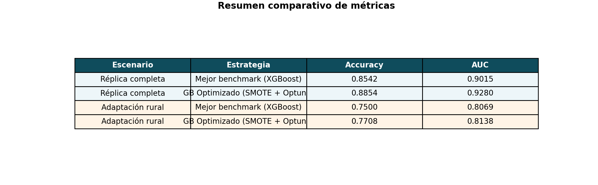
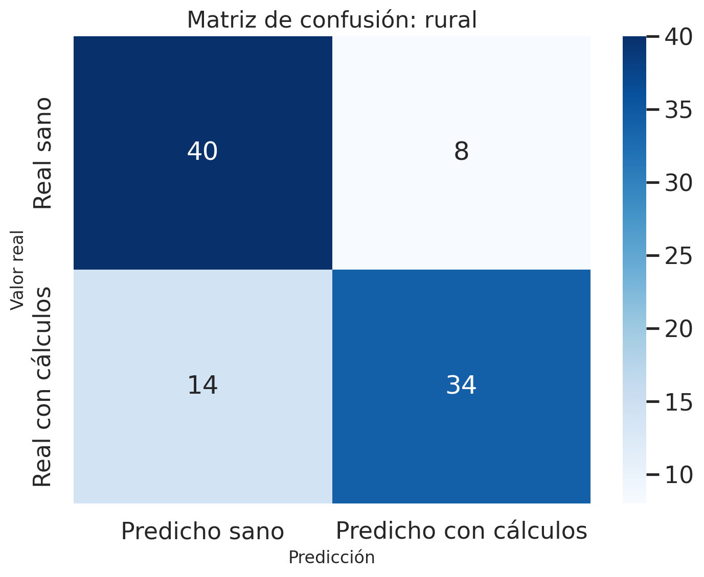
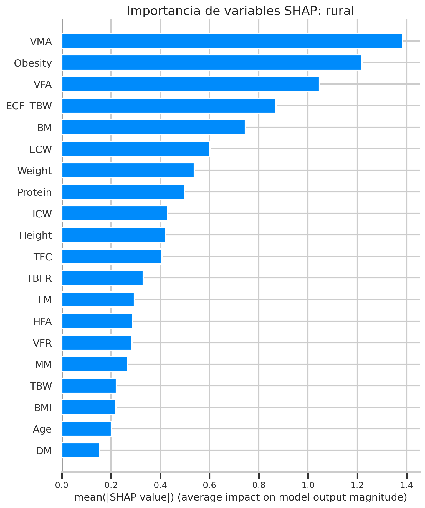

# Portafolio ML: réplica de paper + adaptación rural para Perú

## Resumen ejecutivo
Este repositorio documenta un proyecto de machine learning sobre predicción de cálculos biliares a partir de variables clínicas, antropométricas y de bioimpedancia. El trabajo original tuvo dos objetivos:

1. reproducir el enfoque publicado en un paper de 2024,
2. rediseñar el problema para un escenario de tamizaje rural en Perú, eliminando la dependencia de pruebas de laboratorio.

La versión pública de este repo está pensada como caso de estudio para portafolio DS/ML: deja dos notebooks finales ejecutados, resultados comparables, figuras estáticas para GitHub y una narrativa centrada en decisiones de modelado, tradeoffs y límites de despliegue.

## Problema y contexto sanitario
El paper original trabaja sobre predicción temprana de cálculos biliares usando una combinación de variables demográficas, bioimpedancia y laboratorio. La adaptación que hicimos cambia el objetivo práctico: en lugar de asumir acceso a exámenes clínicos, se formula un modelo de **tamizaje y priorización de riesgo** que podría apoyar brigadas de salud, visitas domiciliarias o campañas en zonas rurales del Perú.

El punto importante es el cambio de restricción operativa:

- la réplica completa busca fidelidad metodológica,
- la versión rural busca reducir fricción de captura de datos,
- el resultado final no se presenta como diagnóstico clínico ni como sistema listo para despliegue.

## Dataset y paper fuente
- Dataset base: [Gallstone - UCI Machine Learning Repository](https://www.archive.ics.uci.edu/dataset/1150/gallstone-1)
- Paper fuente: [Early prediction of gallstone disease with a machine learning-based method from bioimpedance and laboratory data](https://pubmed.ncbi.nlm.nih.gov/38394521/)
- DOI del paper/dataset: `10.1097/MD.0000000000037258`

Notas de trazabilidad:

- El paper fue publicado en `Medicine` en febrero de 2024.
- La ficha actual de UCI indica que los datos provienen de Ankara, Turquía.
- El archivo incluido en este repo (`data/dataset-uci.xlsx`) contiene `319` registros y `38` predictores más la variable objetivo.
- El paper describe datos originalmente disponibles por solicitud; este repo usa la release pública posterior en UCI.
- La release pública actual no coincide de forma perfecta con la descripción narrativa del paper en conteo y naming de variables; la reconciliación detallada se mantiene en la documentación interna del proyecto.

## Cómo está organizado el caso de estudio
### 1. Réplica del paper
- Usa el dataset completo.
- Mantiene división estratificada `70/30`.
- Escala variables con `StandardScaler`.
- Replica la selección de `32` variables con ANOVA F-score.
- Compara cinco modelos base: Logistic Regression, Random Forest, Gradient Boosting, XGBoost y CatBoost.
- Rejuega de forma determinista la mejor configuración de `Gradient Boosting + SMOTE + Optuna` registrada en el experimento original.

Notebook: [`notebooks/01_replicacion_paper.ipynb`](notebooks/01_replicacion_paper.ipynb)

### 2. Adaptación rural para Perú
- Conserva solo variables medibles en campo: demografía, comorbilidades, antropometría y bioimpedancia.
- Elimina variables de laboratorio para simular una captura de datos factible fuera de un entorno clínico completo.
- Mantiene el mismo esquema de evaluación para poder comparar pérdida de rendimiento frente al escenario completo.

Notebook: [`notebooks/02_adaptacion_rural_peru.ipynb`](notebooks/02_adaptacion_rural_peru.ipynb)

## Variables que se conservaron y variables que se retiraron
### Variables conservadas en la versión rural
- Edad, género e historial de comorbilidades.
- Altura, peso, BMI.
- Medidas de bioimpedancia: `TBW`, `ECW`, `ICW`, `ECF_TBW`, `TBFR`, `LM`, `Protein`, `VFR`, `BM`, `MM`, `Obesity`, `TFC`, `VFA`, `VMA`, `HFA`.

### Variables excluidas por requerir laboratorio
- `Glucose`
- `TC`
- `LDL`
- `HDL`
- `Triglyceride`
- `AST`
- `ALT`
- `ALP`
- `Creatinine`
- `GFR`
- `CRP`
- `HGB`
- `VitaminD`

## Resultados comparativos
| Escenario | Mejor benchmark | Accuracy | AUC |
| --- | --- | ---: | ---: |
| Réplica completa | XGBoost | 0.8542 | 0.9015 |
| Réplica completa | GB Optimizado (SMOTE + Optuna) | 0.8854 | 0.9280 |
| Adaptación rural | XGBoost | 0.7500 | 0.8069 |
| Adaptación rural | GB Optimizado (SMOTE + Optuna) | 0.7708 | 0.8138 |

Lectura técnica rápida:

- La réplica completa reproduce el orden de magnitud reportado por el paper y mejora el benchmark con `Gradient Boosting + SMOTE`.
- La versión rural pierde rendimiento frente al escenario completo, pero mantiene señal predictiva útil aun sin laboratorio.
- El tradeoff que interesa al portafolio no es “máxima accuracy”, sino “qué rendimiento se conserva cuando el costo operativo de medir variables baja de forma importante”.

## Figuras clave
### Resumen comparativo


### Matriz de confusión del escenario rural


### Importancia de variables del escenario rural


## Limitaciones
- El dataset es pequeño: `319` casos.
- No hay validación externa ni cohortes de Perú.
- Los datos provienen de un hospital en Turquía, no de operativos rurales peruanos.
- La bioimpedancia del dataset no garantiza equivalencia con sensores portátiles de campo.
- La pieza no cubre calibración clínica, análisis de costo por error, ni evaluación prospectiva.
- El uso razonable del modelo, con la evidencia actual, es tamizaje/priorización y no diagnóstico.

## Autoría
Proyecto desarrollado por:
- **Rody Vilchez** — UPC
- **Alejandro Untiveros** — PUCP
- **Alejandro Gutierrez** — PUCP
- **Elizabeth Cruces** — UNMSM

Este repositorio es una extensión del caso de estudio original: el equipo diseñó y ejecutó tanto la réplica experimental como la reformulación rural. La versión pública consolida ese trabajo en una estructura reproducible con narrativa técnica de portafolio.

## Documentación interna
El repositorio se mantiene además con una vault interna en Markdown bajo `.vault/`, pensada como docs-as-code para entrevistas, narrativa del proyecto y seguimiento profesional. Esa capa convive con la documentación pública, pero excluye notas privadas o sensibles.

## Reproducibilidad
Instalación:

```bash
python -m pip install -r requirements.txt
```

Regenerar notebooks y figuras:

```bash
python scripts/build_portfolio_assets.py
```

Auditoría del paper y validación metodológica adicional:

```bash
python scripts/build_ml_validation_reports.py
```

Eso vuelve a crear:

- `notebooks/01_replicacion_paper.ipynb`
- `notebooks/02_adaptacion_rural_peru.ipynb`
- `figures/metrics_comparison.png`
- `figures/rural_confusion_matrix.png`
- `figures/rural_feature_importance.png`
- `results/ml/` con reportes de validación repetida, curvas y tablas de thresholds

## Licencia
El código y la documentación de este repositorio se publican bajo licencia MIT. El dataset y el paper fuente mantienen sus propios términos de uso y atribución.

## Estructura del repo
```text
.
├── .vault/
├── README.md
├── LICENSE
├── requirements.txt
├── data/
├── figures/
├── notebooks/
├── results/
├── scripts/
└── archive/
```

`archive/` conserva los notebooks históricos y exploratorios del trabajo original, pero no forma parte de la pieza final de portafolio.
