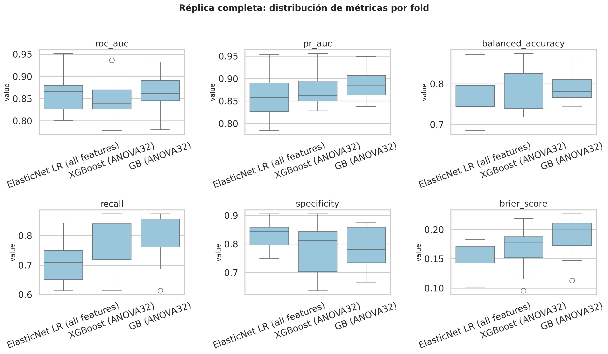
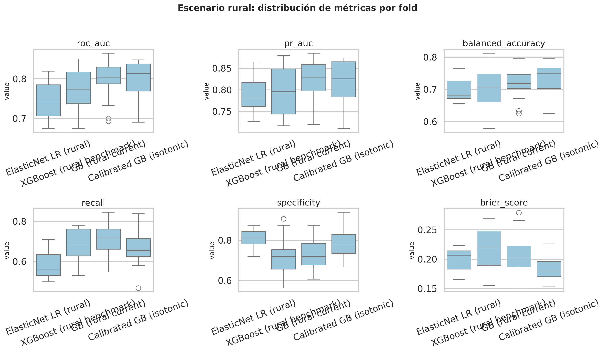
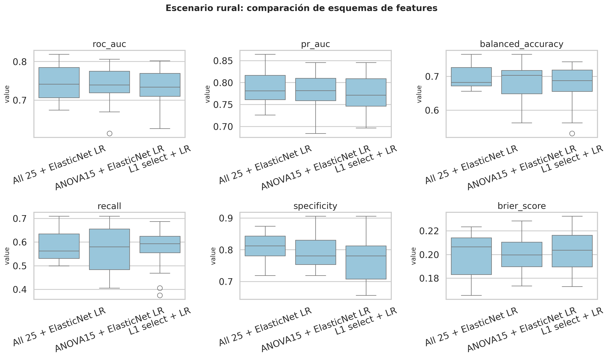
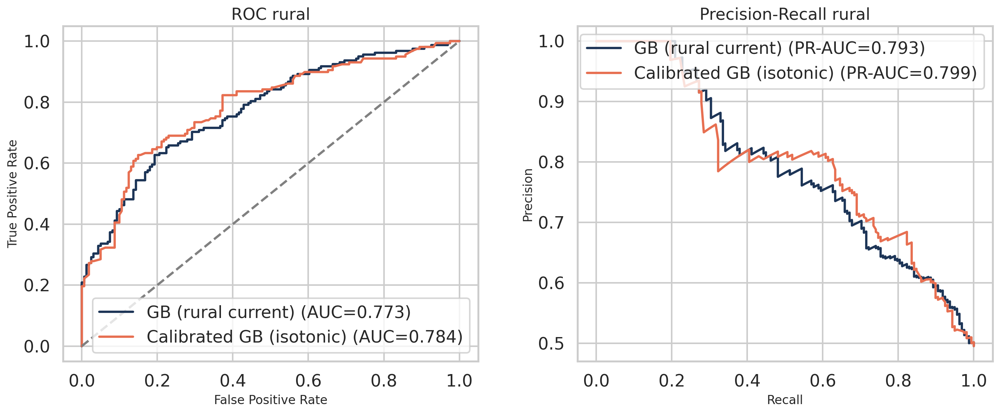
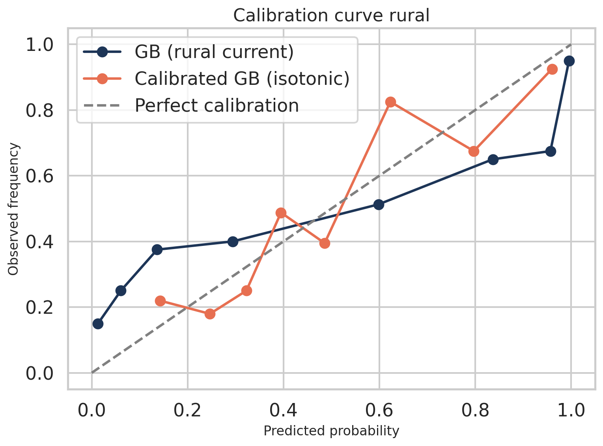
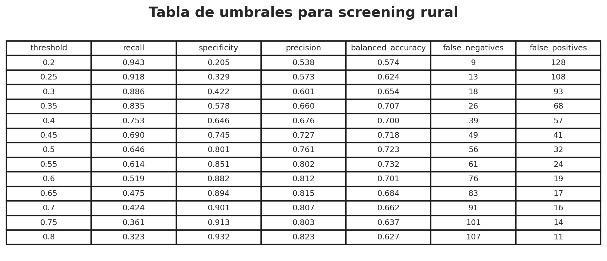
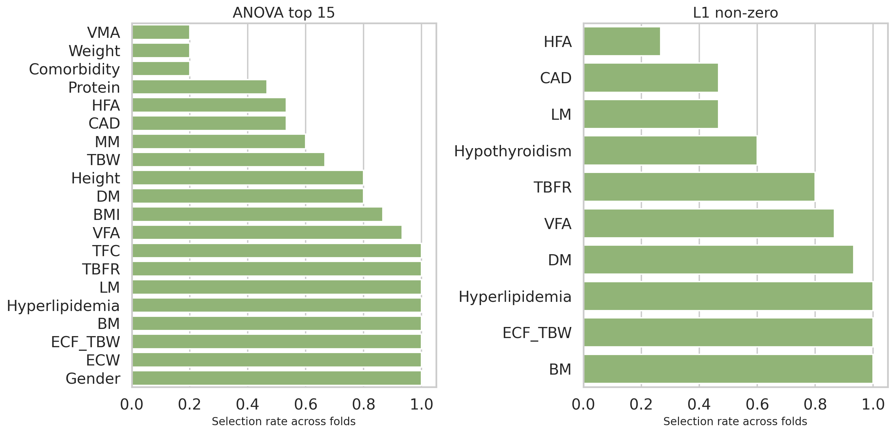

# Validación metodológica

Esta carpeta contiene la salida de `python scripts/build_ml_validation_reports.py`.

## Archivos principales
- `full_repeated_cv_summary.csv`: resumen de métricas por modelo en la réplica completa bajo CV repetida.
- `rural_repeated_cv_summary.csv`: resumen de métricas por modelo en el escenario rural.
- `rural_feature_scheme_summary.csv`: comparación de tres esquemas de selección de variables para el caso rural.
- `rural_threshold_table.csv`: tabla de umbrales del modelo calibrado para discutir screening.
- `rural_feature_stability.csv`: frecuencia de selección de variables rurales entre folds.
- `validation_manifest.json`: manifiesto mínimo de artefactos y metadatos.

## Figuras
- 
- 
- 
- 
- 
- 
- 

## Lectura recomendada
1. `rural_repeated_cv_summary.csv`
2. 
3. `rural_threshold_table.csv`
4. `rural_feature_stability.csv`
